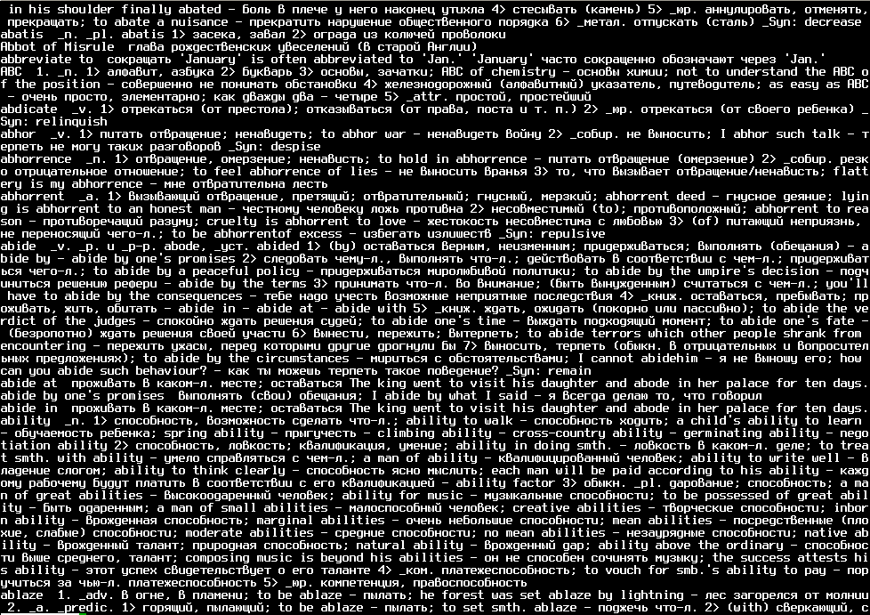
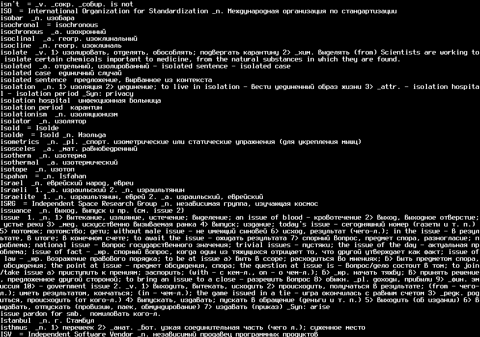

# Англо-русский словарь на диске и поиск по нему в Linux

#### Бывает, что нужно перевести английское слово, но нет возможности/желания открывать онлайн-переводчик (например, нет интернета).
#### Для этого можно использовать словарь Мюллера в формате "mova". Это текстовый документ, в котором каждое слово/словосочетание и перевод его занимает одну строку текста.

#### скачать можно было здесь:  
[http://mueller-dic.chat.ru/](http://mueller-dic.chat.ru/)  
[http://mueller-dic.chat.ru/Mueller24.tgz](http://mueller-dic.chat.ru/Mueller24.tgz)

#### Словарь внутри архива:  
/usr/local/share/dict/Mueller24.koi

#### Словарь по этой ссылке в кодировке KOI8-R. в моей системе в основном используется UTF-8, поэтому, нужно сначала конвертировать словарь в UTF-8 командой:
```  cat Mueller24.koi | iconv -f koi8-r -t utf-8 >Mueller24.utf8```

#### Попробуем использовать. Я хочу найти слово "is". Используем команду:
```  cat Mueller24.utf8 | grep -i "is"```



#### Выдало очень много результатов - все строки, где встречается комбинация букв "is". Уточним поиск: ищем строку, которая \_начинается\_ с "is":
```  cat Mueller24.utf8 | grep -i "^is"```



#### Уже лучше, но в выдаче мы видим, например, слово "issue". Нужно уточнить ещё.
#### Внимательно осмотрев файл, можно заметить, что слово/словосочетание в словаре Мюллера отделяется от перевода двумя(!) пробелами. Используем это наблюдение:
```  cat Mueller24.utf8 | grep -i "^is  "```

#### Вот, теперь то, что нужно. Результаты, которые я получил:
*IS*  \_I Information Systems \_n. информационные системы \_II International Standard \_n. международный стандарт  
*is*  \_v. 3rd \_sg. \_pres. of be

#### напишем скрипты, которые будут удобны в использовании:

**enru.sh:**
```
#!/bin/bash
while read -p 'enter words: ' W
do
  cat Mueller24.utf8 | grep -i "^$W" | awk '{print $0, "\n";}' | less
done
```

**enruexact.sh:**
```
#!/bin/bash
while read -p 'enter words: ' W
do
  cat Mueller24.utf8 | grep -i "^$W  " | awk '{print $0, "\n";}' | less
done
```

В этих скриптах Awk используется чтобы разделить результаты пустой строкой, а less для просмотра и навигации по результатам.


#### больше статей на канале в Telegram [assistpc](https://t.me/assistpc)


