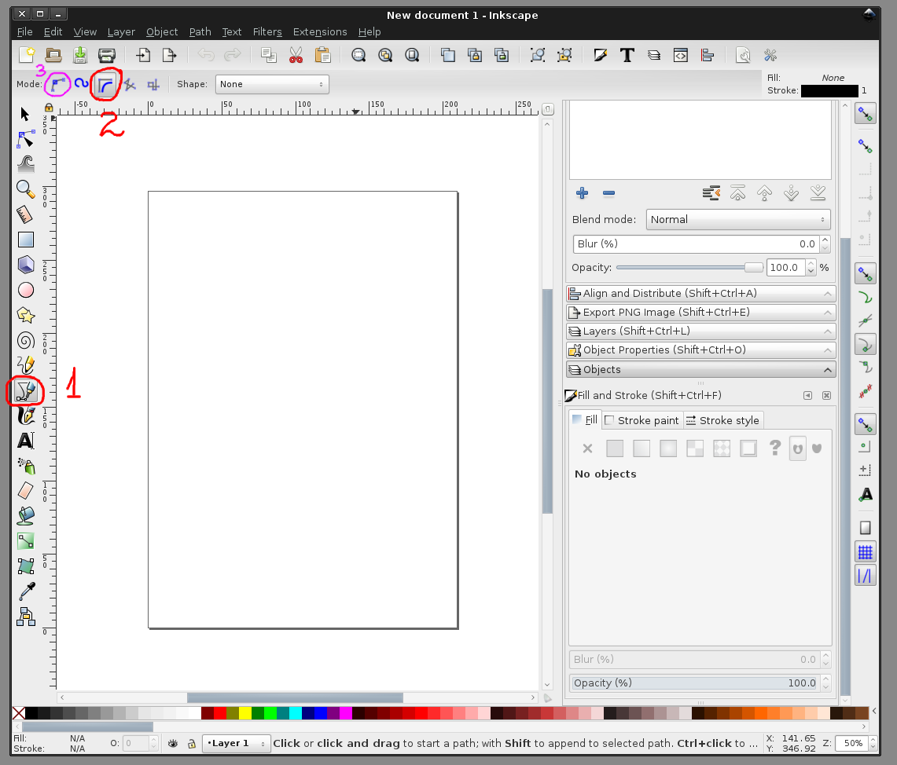
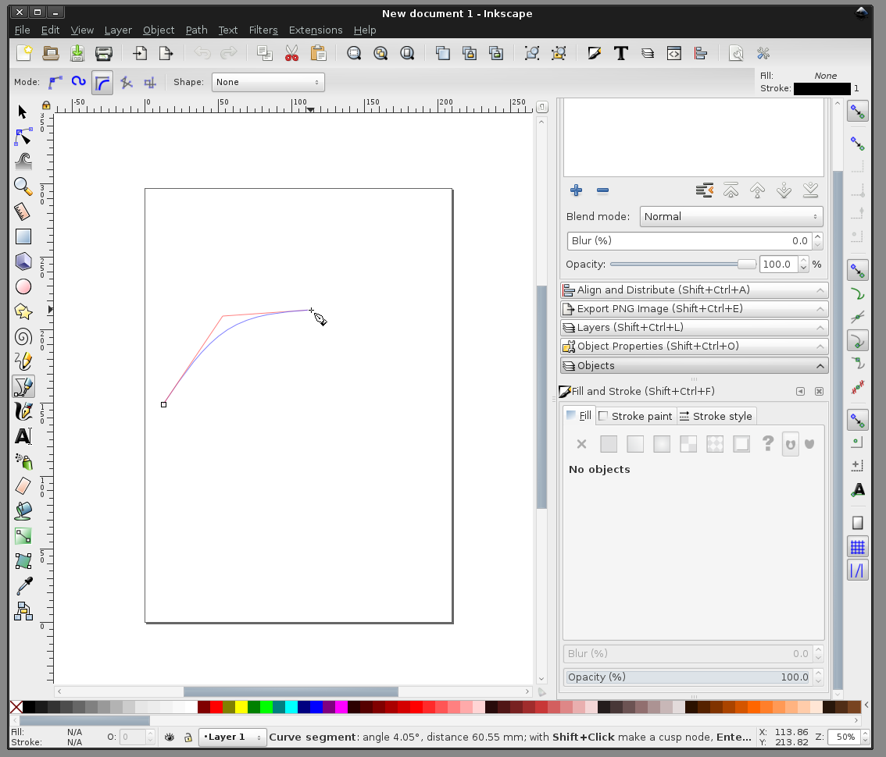
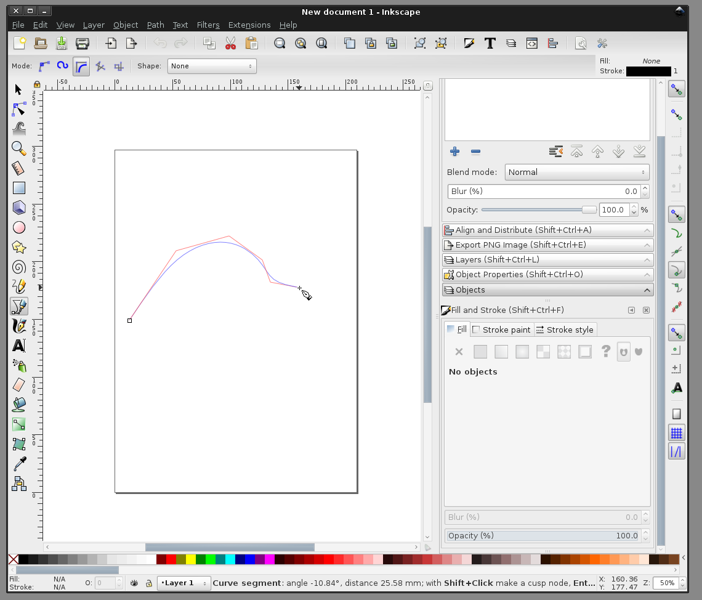
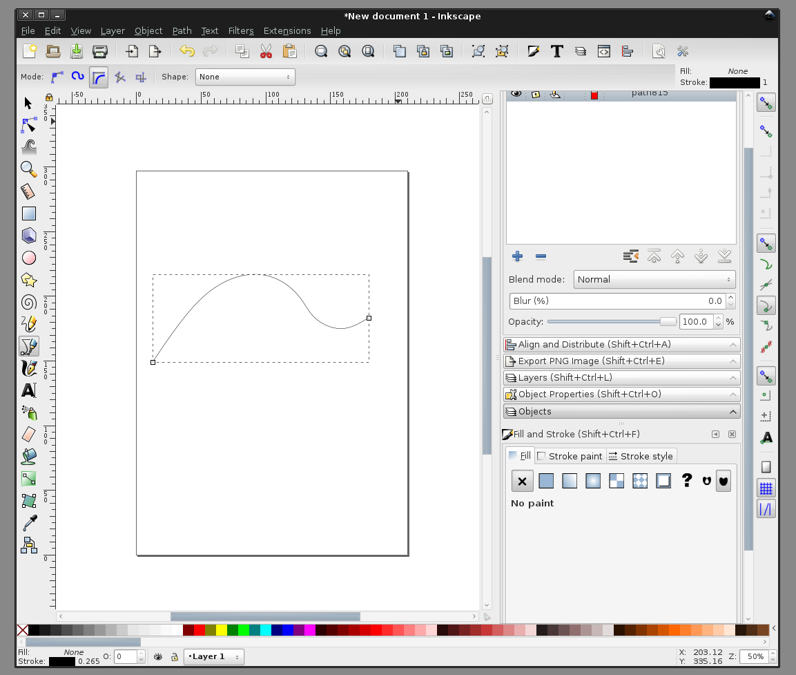
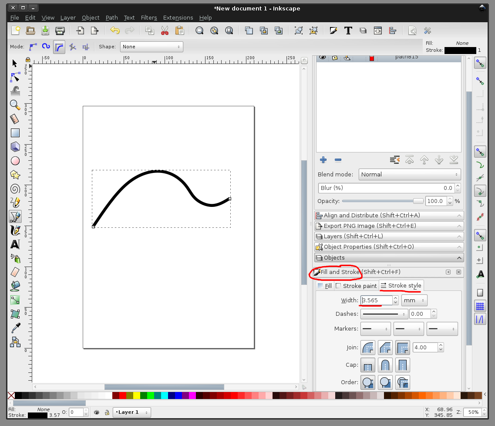
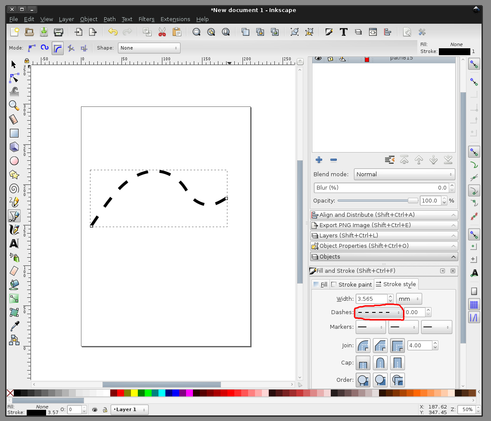

# рисование в Inkscape. Рисование кривых
  
  
Выбираем инструмент "рисование кривых" (1). После этого выбираем на верхней панели тип кривой "BSpline" (2).  
Если в вашей версии нет такого типа линий, то подобное тому, что мы нарисуем ниже, можно нарисовать и кривыми типа "Безье" (на рисунке помечено (3) ). Я планирую написать о них в следующей статье  

  
  
Нажимаем левой кнопкой мыши на листе, откуда должна начинаться линия  

  
  
Продолжаем нажимать на листе в точках, которые определят путь линии. В процессе рисования можно увидеть, как она строится: углы между красными отрезками - там где я нажимал, а синяя плавная линия - то, как линия будет выглядеть  

  
  
В последней точке нужно сделать двойной клик, чтобы завершить линию  

  
  
Линии в Inkscape - это обводки. Чтобы изменить линию, используем инструменты для работы с обводкой: "Fill and stroke" -> вкладка "Stroke style". Увеличим толщину. Напоминаю, что красить обводки нужно кликая на цвет через Shift (обычный клик по цвету в нижней панели красит сам обьект).  

  
  
Сделаем линию прерывистой  

  
  
больше статей можно найти на канале в Telegram: <a href='https://t.me/assistpc'>https://t.me/assistpc</a>  
