# рисование в Inkscape. Рисование кривых. Рисование кривых Безье
  
  
Выбираем инструмент "рисование кривых" (1). После этого выбираем на верхней панели тип кривой "Bezier" (2).  
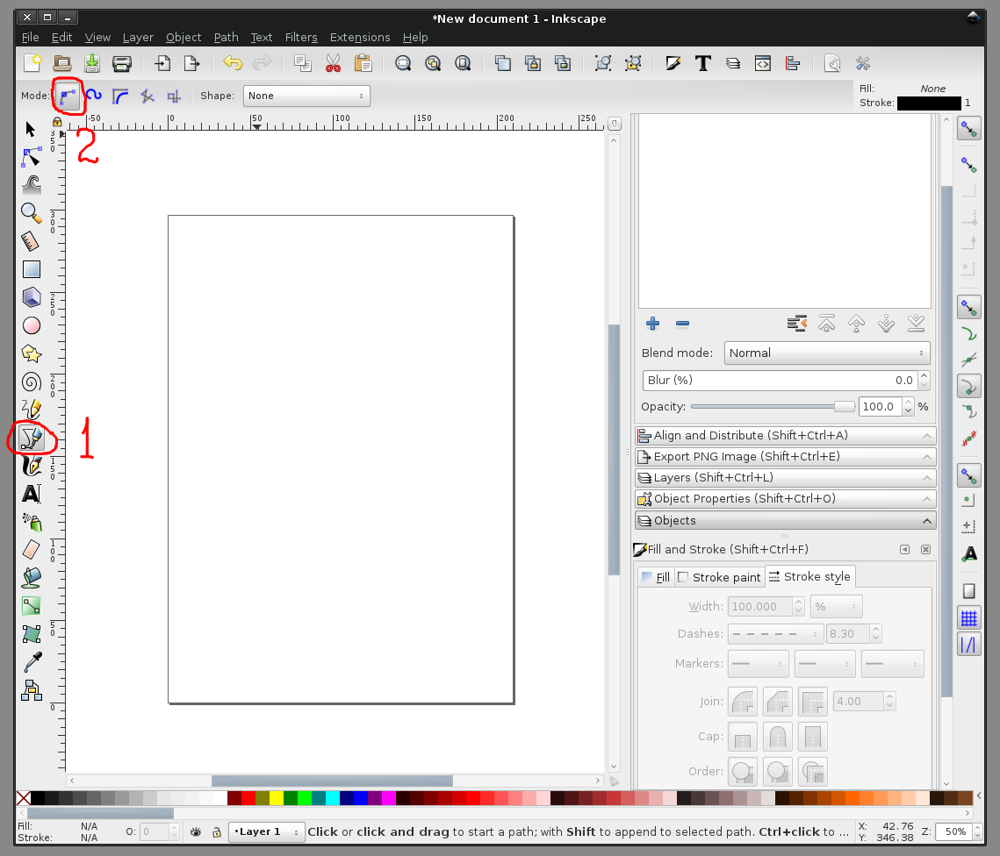
  
  
Делаем первый клик левой кнопкой мышки на листе, чтобы начать линию и рисуем, кликая в точках, через которые будет проходить кривая. Она так и будет выглядеть  
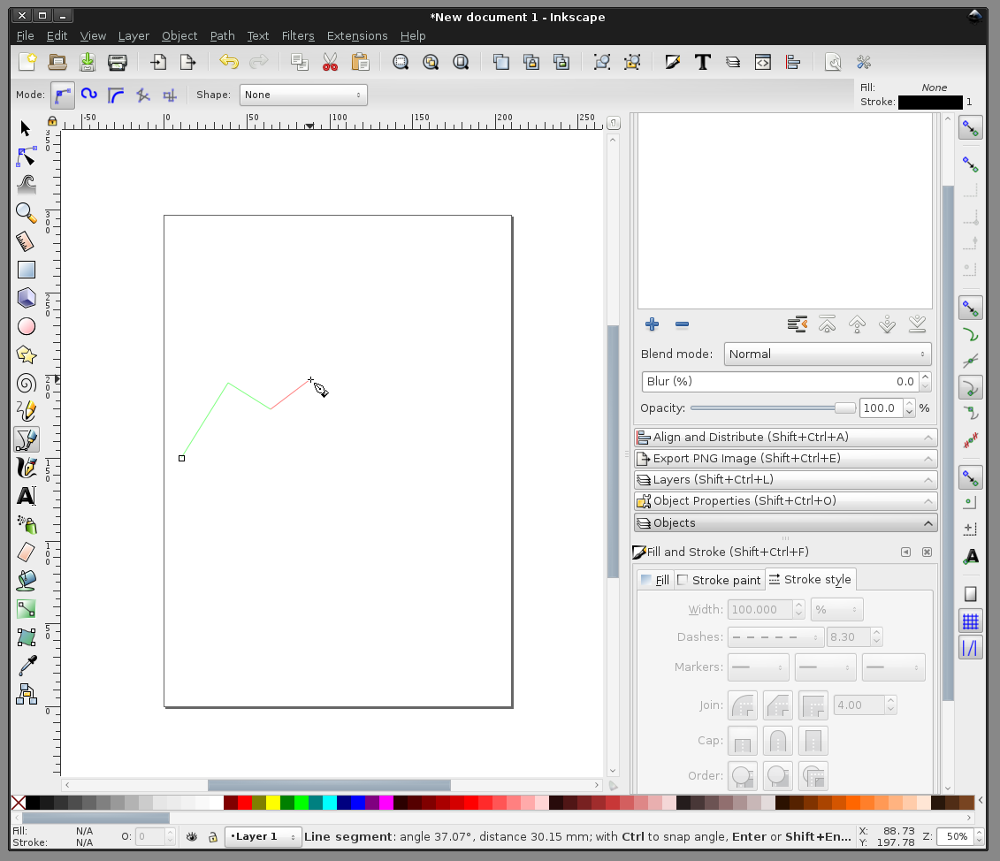
  
  
Если нажать левую кнопку мыши, но, не отпуская, протащить её в определенном направлении, то через этот узел кривая пройдёт более сглаженной.  
Для кривых, в которых много углов, или углы должны быть резкими, я чаще использую кривые Безье. Для плавных очертаний я чаще использую кривые BSpline.  
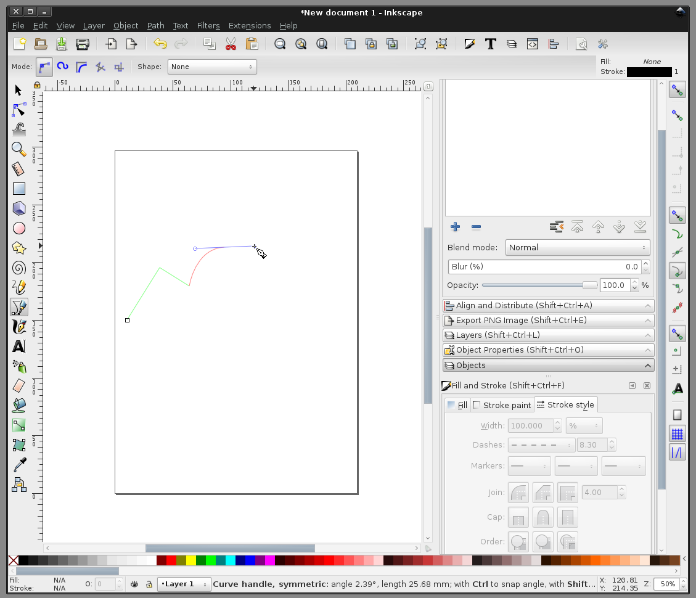
  
  
Нарисуем замкнутый контур. Для этого рисование нужно довести до первого нарисованного узла  
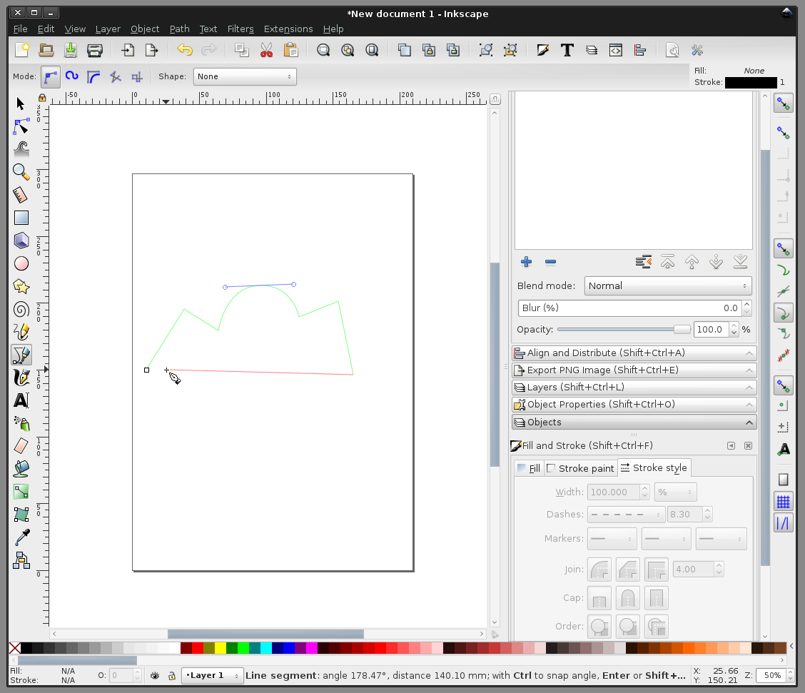
  
  
Завершить, кликнув левой кнопкой один раз в первый узел. Также рисование можно завершать и правой кнопкой мыши, но поведение может быть немного другим  
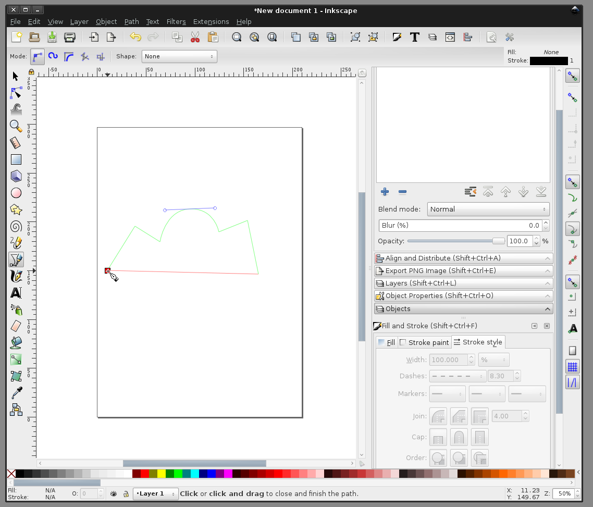
  
  
Вот фигура. Нарисуем ещё одну, но разомкнутую  
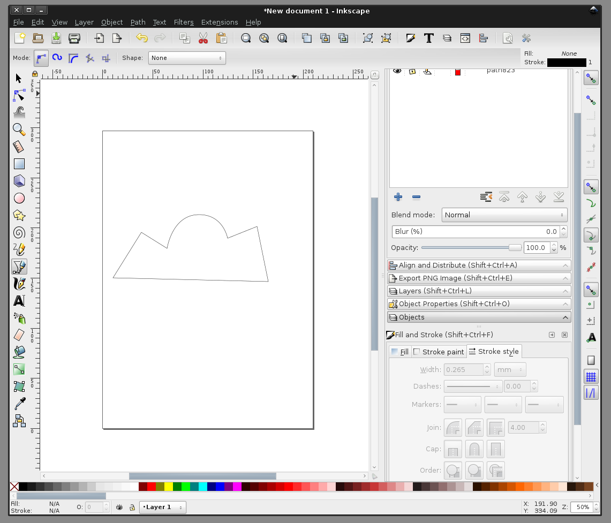
  
  
Выберем "стрелку для выделения, поворота и перемещения" (1) и выделим оба контура (2)  
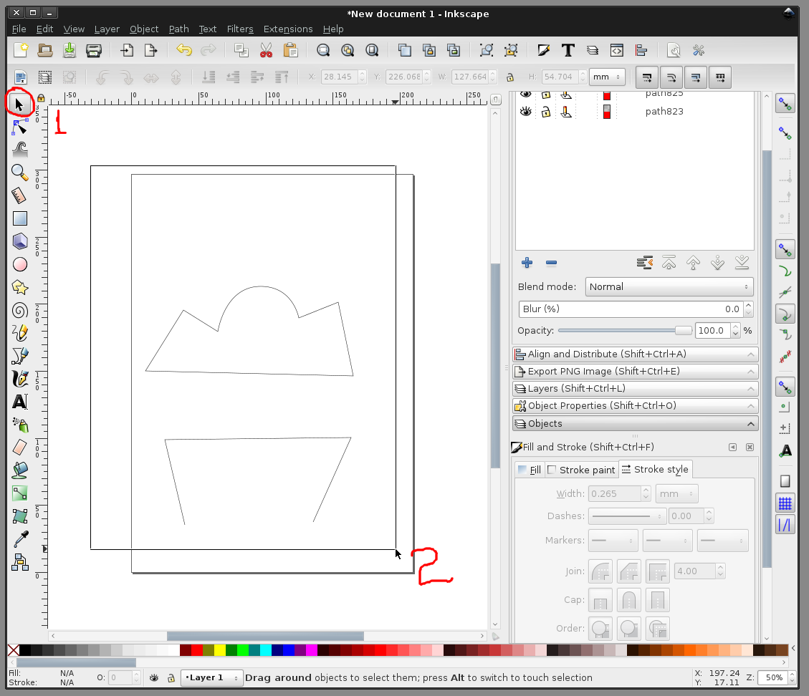
  
  
Выделено  
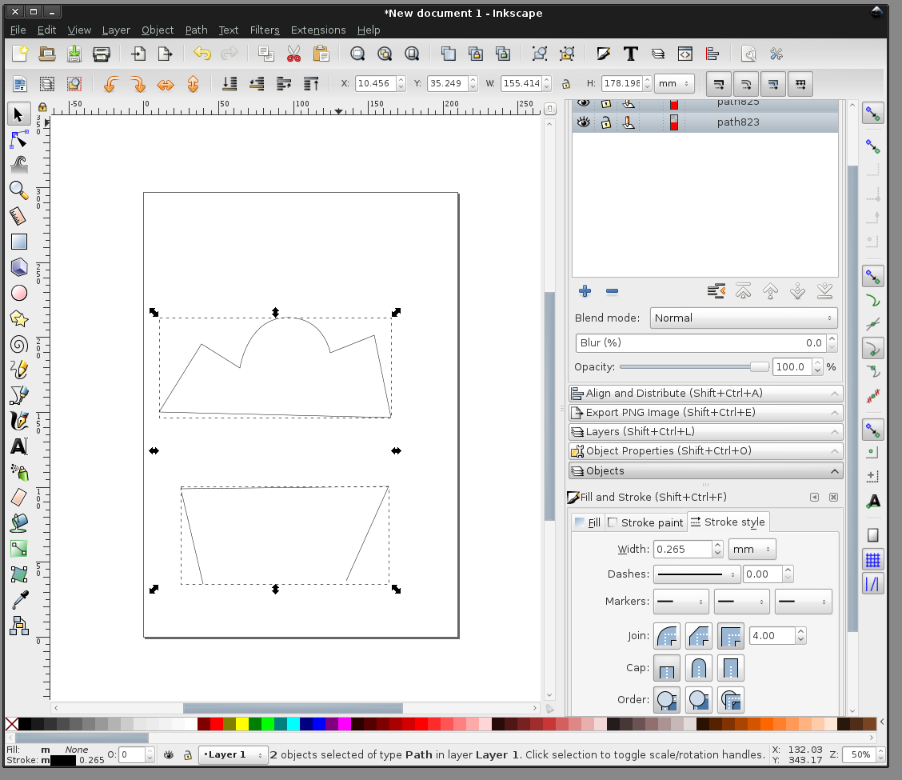
  
  
Настроим толщину контура обоих выделенных обьектов одним разом  
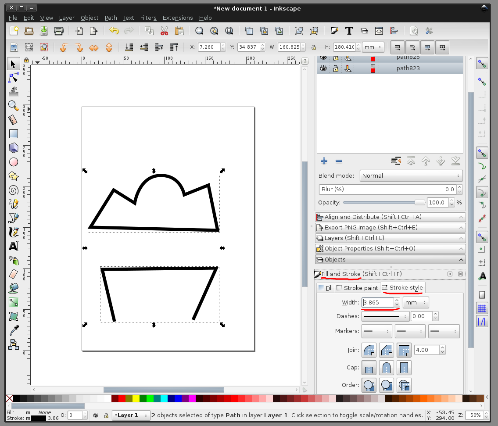
  
  
Выберем цвет самого обьекта (да - контур, даже в таком случае, является контуром обьекта). Можно увидеть, как выглядят обьекты и как они покрасились  
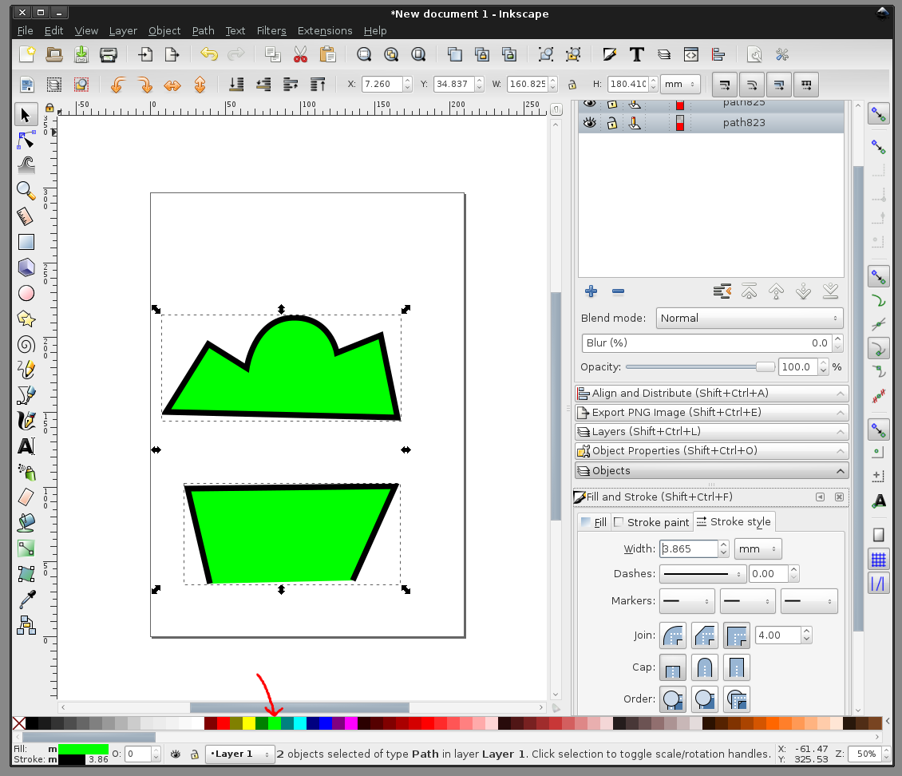
  
  
Отредактируем один из обьектов. Для этого выберем "стрелку для редактирования контуров и прочих мелких вещей".  
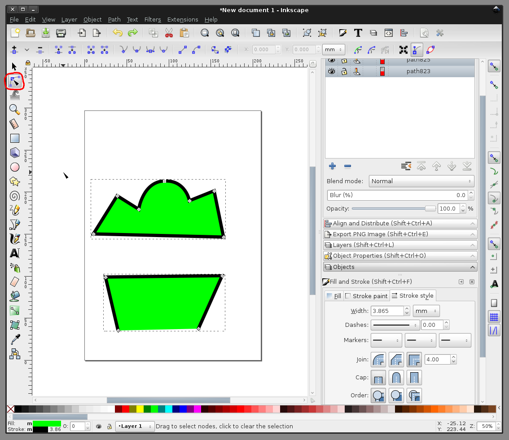
  
  
Потянув за одну из сторон обьекта, её можно искривить. Таскать можно также и узлы  
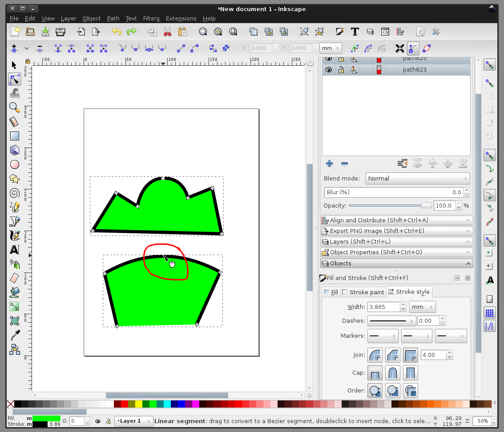
  
  
больше статей можно найти на канале в Telegram: <a href='https://t.me/assistpc'>https://t.me/assistpc</a>  
