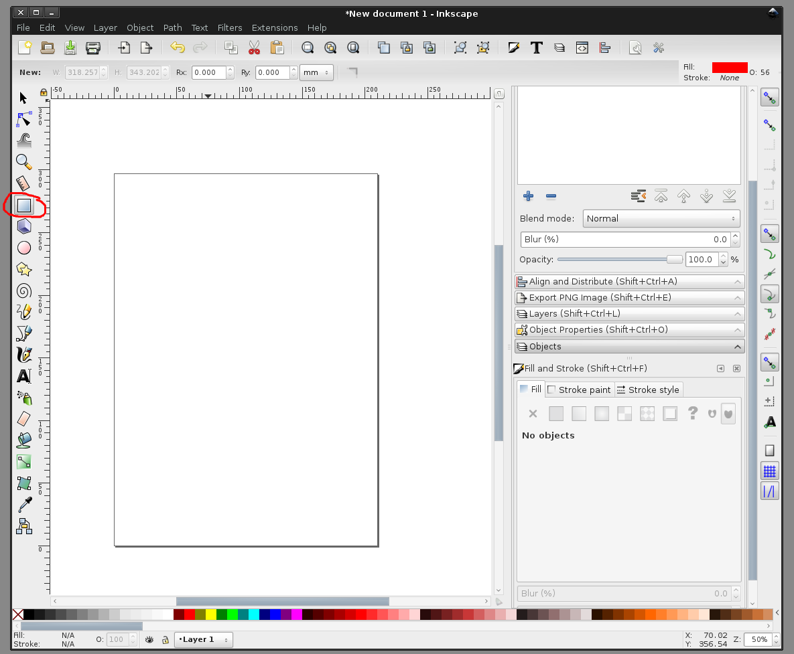
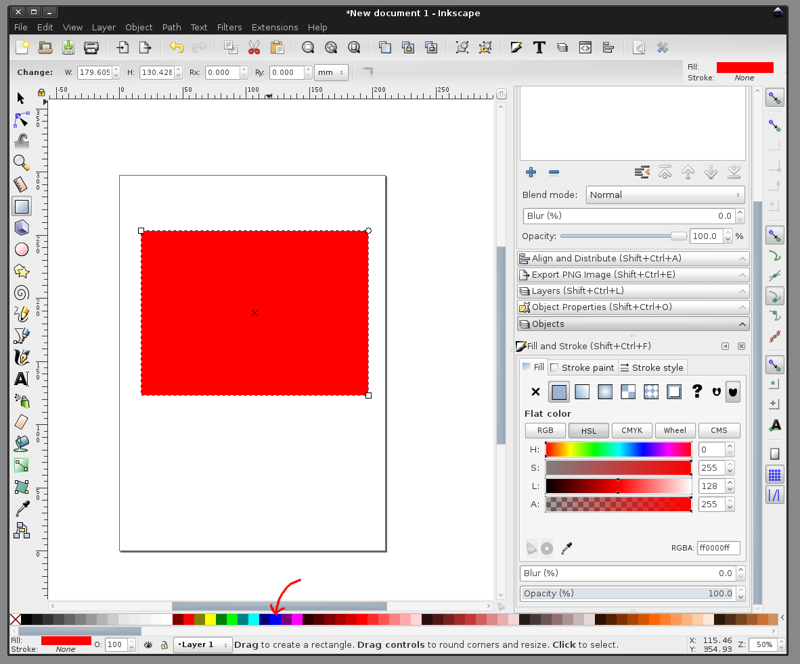
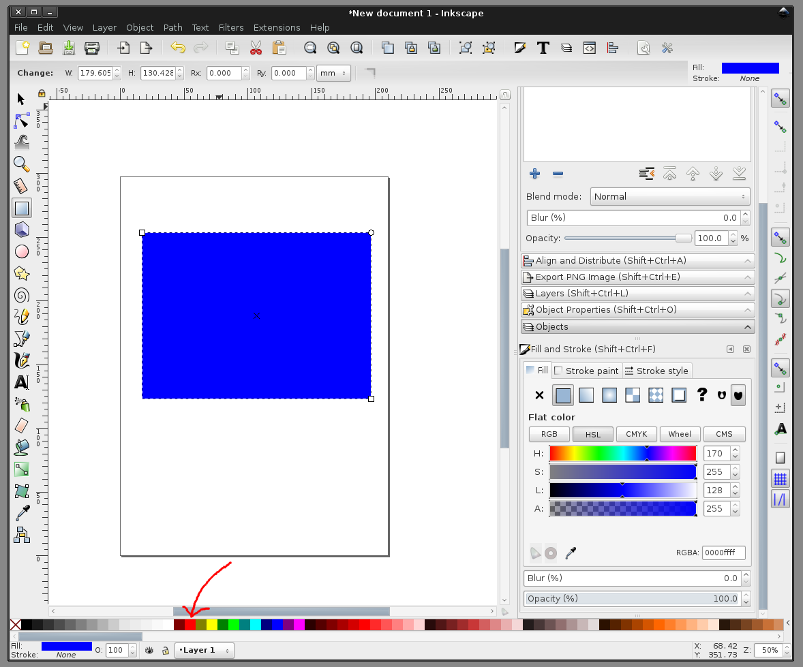
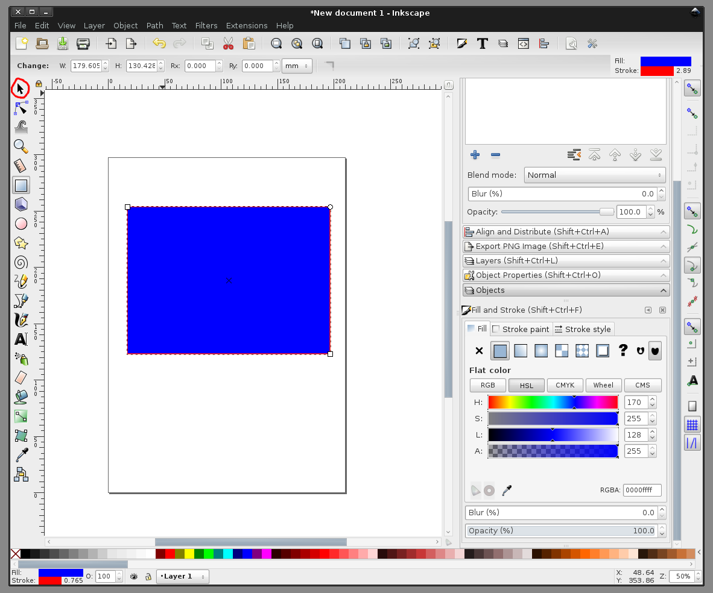
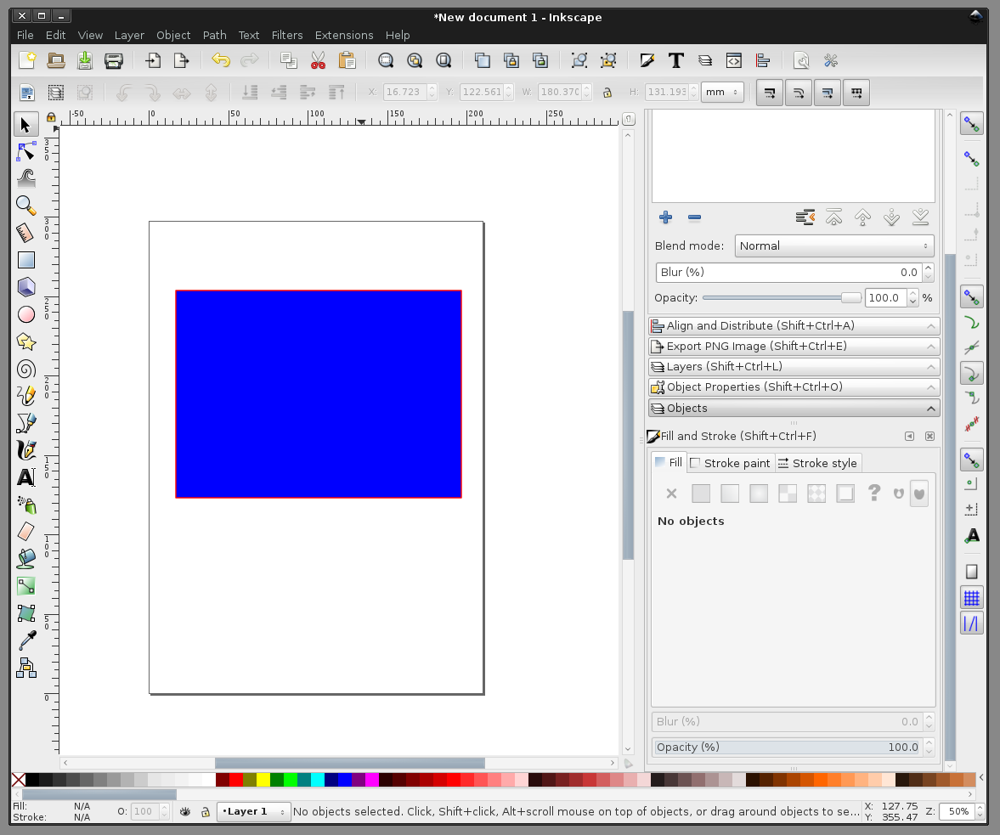

##рисование в Inkscape. прямоугольник и его обводка
  
Нарисуем прямоугольник. Выбираем инструмент "рисование прямоугольника" и на виртуальном листе бумаги рисуем прямоугольник, зажав левую кнопку мыши, протянув мышью из угла в угол и отпустив кнопку.  

  
Прямоугольник может быть неподходящего цвета (у нас красный). После рисования, сменим его цвет: кликаем по цвету в нижней панели с цветами левой кнопкой мыши  

  
Теперь прямоугольник синий. Можно также выбрать цвет обводки. Для этого кликаем на цвет так же мышкой, но удерживая Shift. Кликаем, пока не подберем подходящий  

  
Получился синий прямоугольник с красной обводкой. Выбираем черную стрелку "выделения, вращения и перемещения обьектов" и кликаем на пустое место на листе, чтобы снять выделение и посмотреть на результат  

  
Вот такой результат  

  
больше статей можно найти на канале в Telegram: https://t.me/assistpc  
