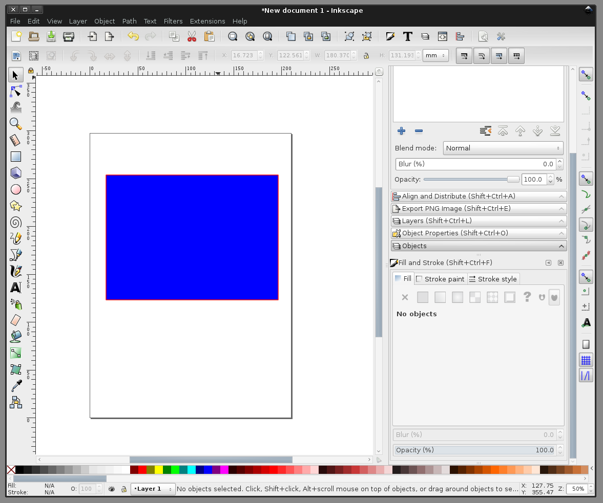
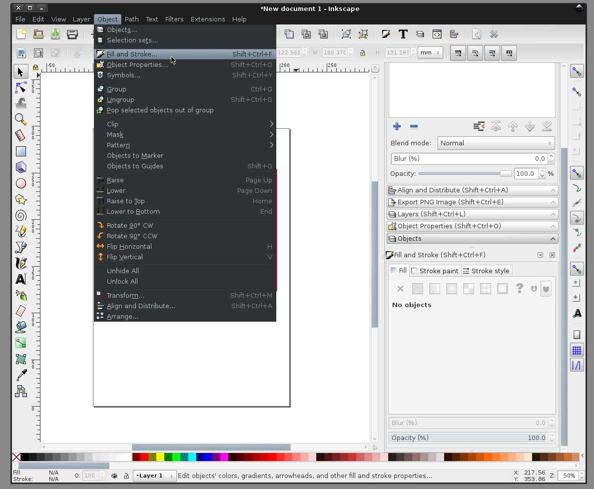
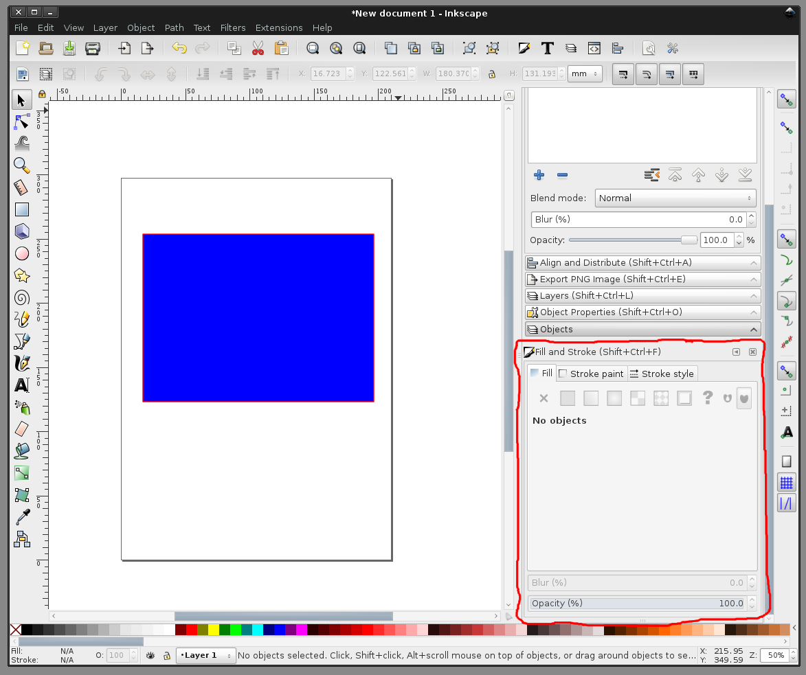
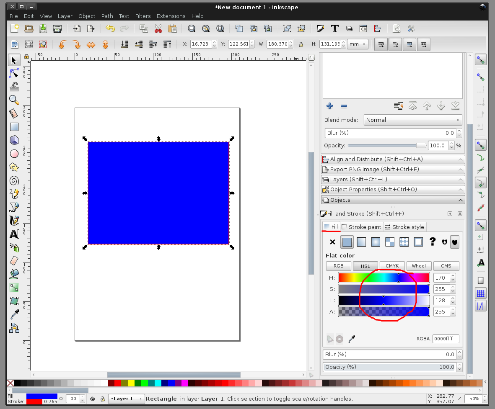
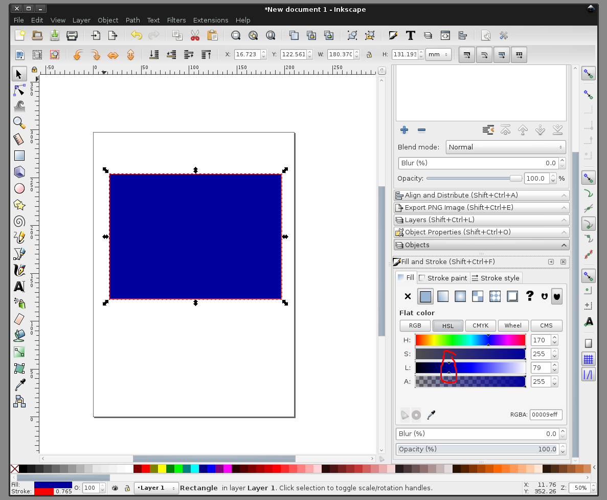
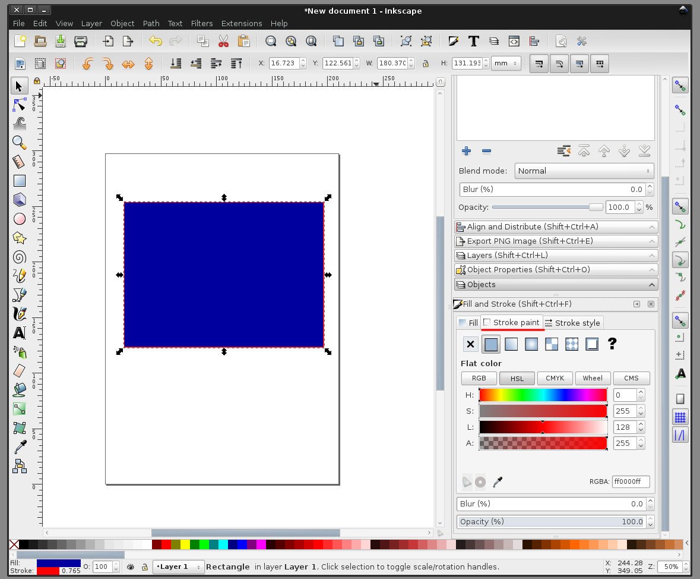
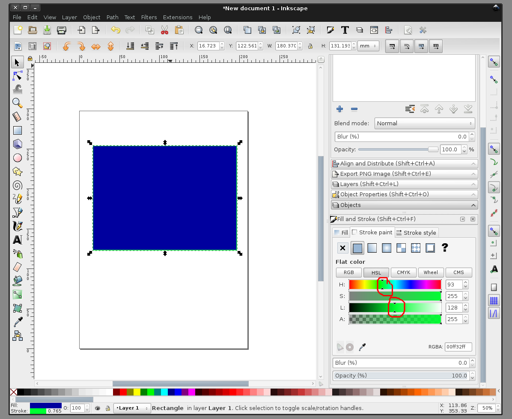
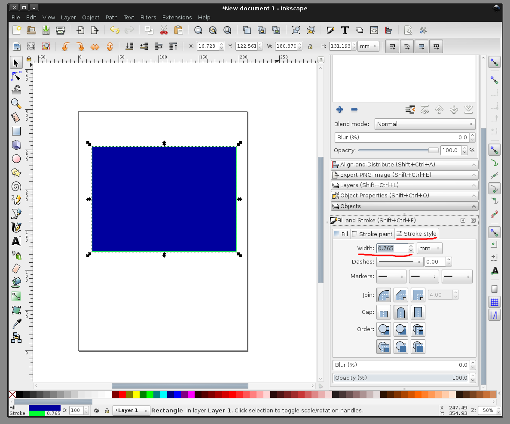
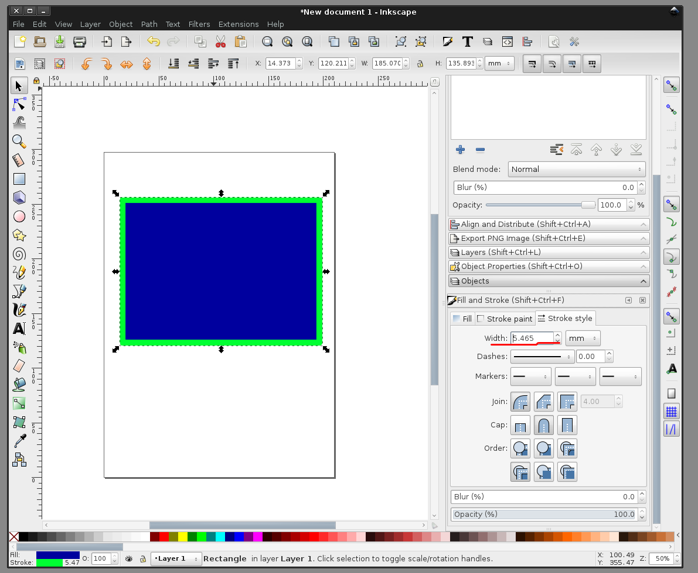

# рисование в Inkscape. панель с иконкой кисточки. настройка цвета обьекта, обводки обьекта. настройка толщины обводки
  
  
Поработаем над этим нарисованным прямоугольником  

  
  
Выбираем из меню "Object" -> "Fill and Stroke"  

  
  
После нажатия элементы управления появятся где-то в окне редактора (у меня справа внизу).  

  
  
Вкладка "Fill" отвечает за цвет самого обьекта. Изменим цвет  

  
  
Цвет изменён.  

  
  
Вкладка "Stroke paint" отвечает за цвет обводки. Изменим цвет  

  
  
Изменено  

  
  
Вкладка "Stroke style" отвечает за толщину, прерывистость, концы обводки. Изменим толщину  

  
  
Изменено  

  
  
больше статей можно найти на канале в Telegram: https://t.me/assistpc  
