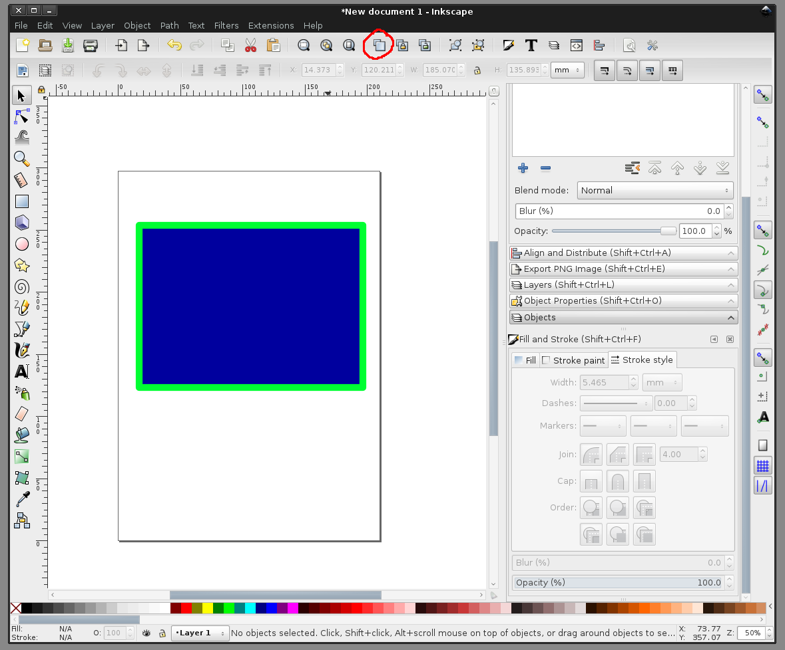
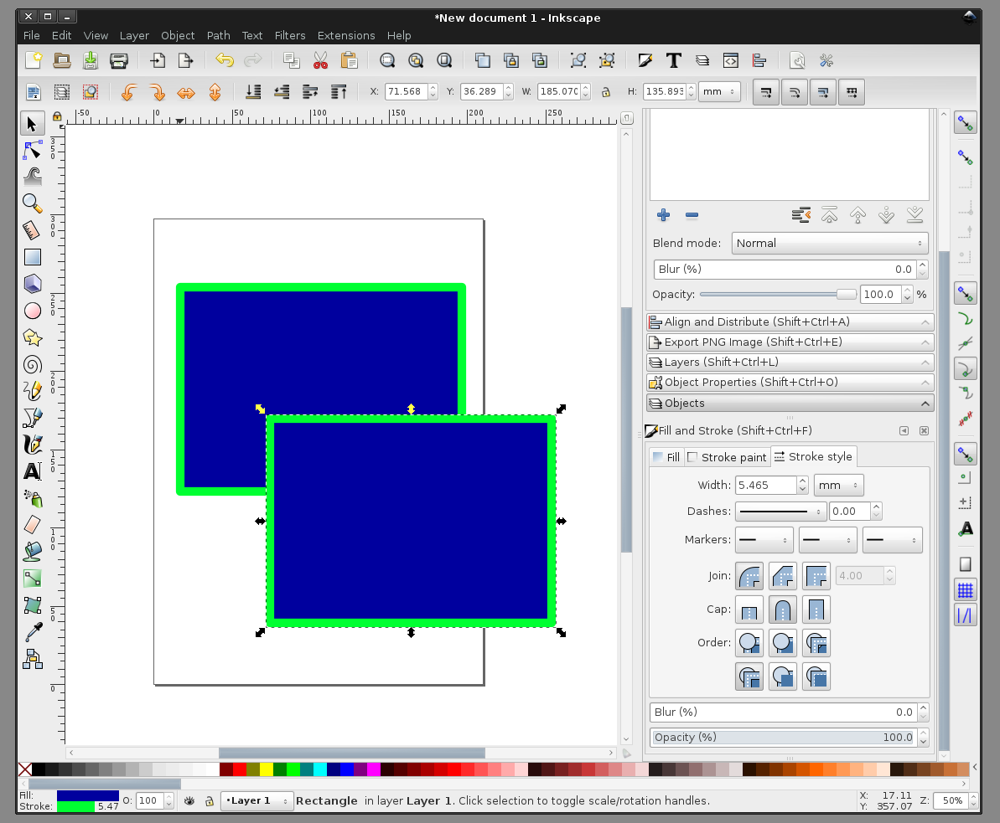
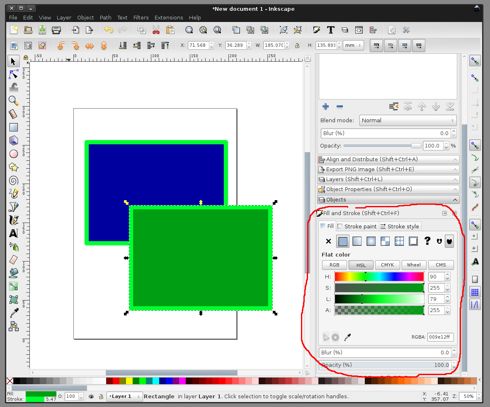
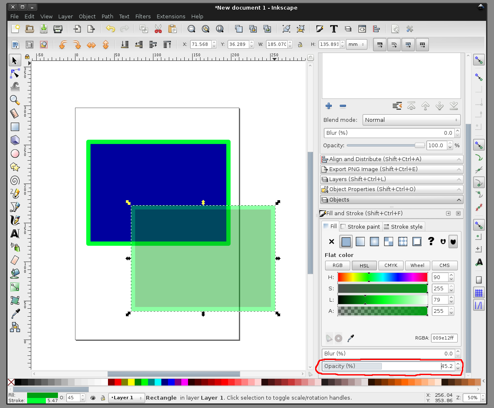
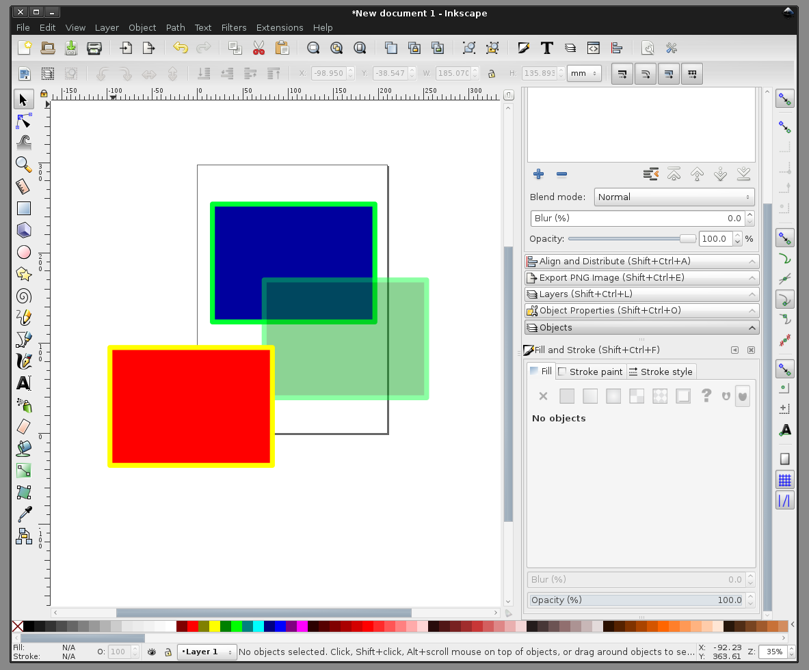
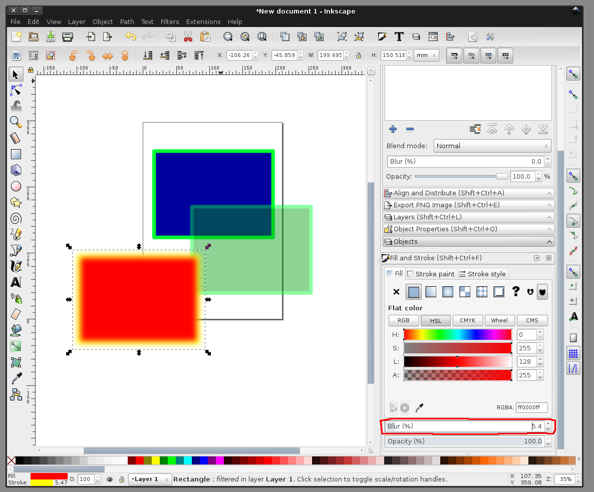
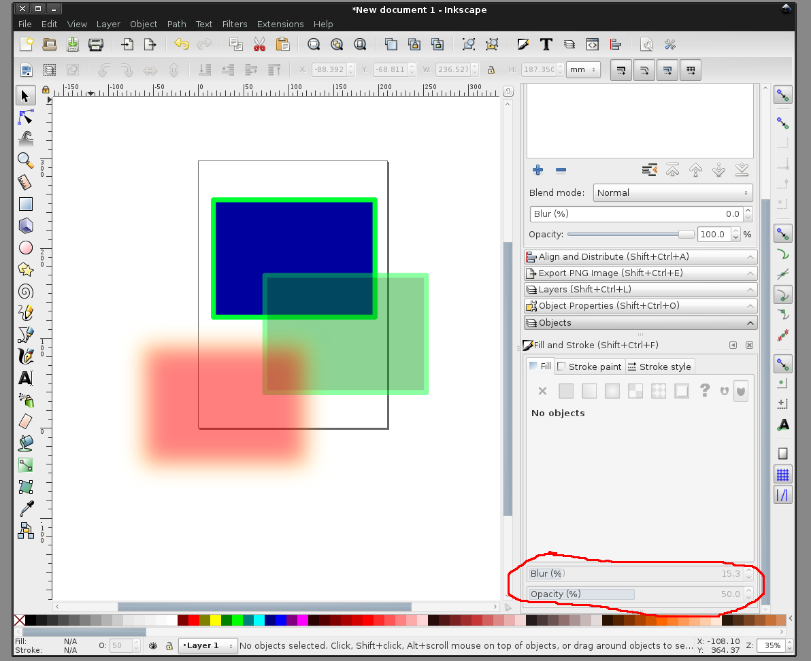

# рисование в Inkscape. дублирование обьекта. прозрачность и размытие объекта
  
  
Продублируем нарисованный прямоугольник указанной кнопкой на верхней панели Inkscape или комбинацией на клавиатуре Ctrl+D  

  
  
Два обьекта  

  
  
Покрасим второй прямоугольник в зеленый цвет с помощью элементов панели "Fill and stroke"  

  
  
Покрутим ползунок прозрачности "Opacity"  

  
  
Зеленый прямоугольник стал полупрозрачным. Продублируем ещё один прямоугольник, сделаем его красным.  

  
  
Используем ползунок размывания "Blur", чтобы размыть красный прямоугольник.  

  
  
Также можно одновременно применять размытие и полупрозрачность к одному обьекту (здесь - к красному)  

  
  
больше статей можно найти на канале в Telegram: https://t.me/assistpc  
