# Отложенное выключение компьютера в ОС Windows

#### Воспользуемся стандартной командой командной строки Windows - shutdown.  

#### Помощь по данной команде можно получить так:  
#### bash shutdown /?
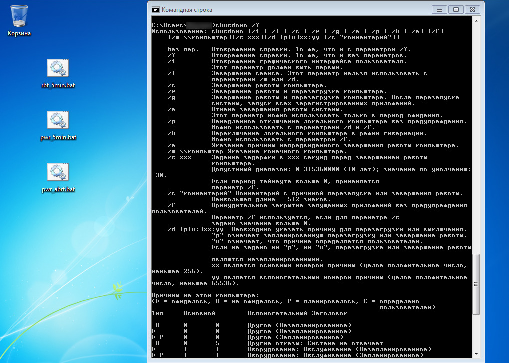

#### Рассмотрим 3 Batch-скрипта:
#### 1. "rbt_5min.bat" - перезагружает через 5 минут
#### 2. "pwr_5min.bat" - выключает через 5 минут
#### 3. "pwr_abrt.bat" - отменяет перезагрузку/выключение
#### Двойной клик по скрипту запустит соответствующее действие.
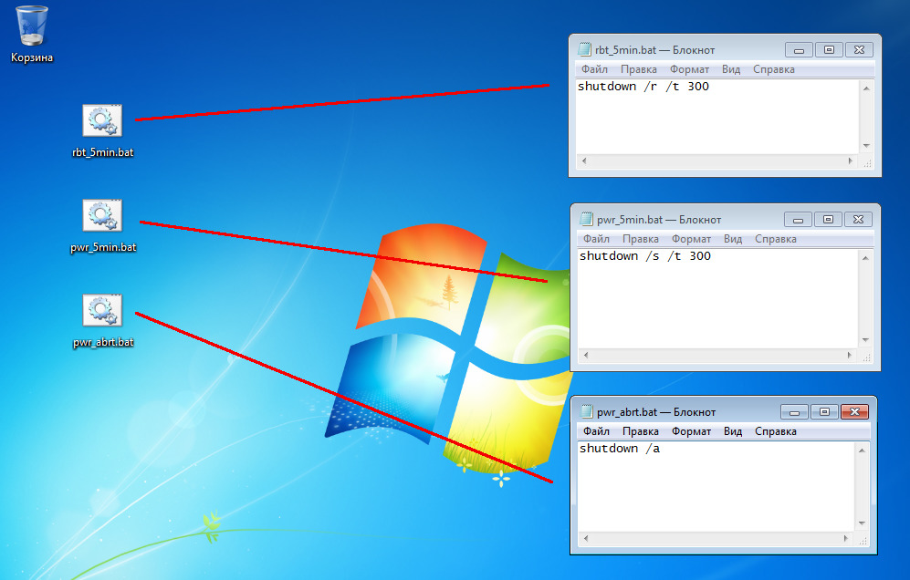
*Если вы не знаете, как создать такие скрипты, то взгляните на статью [легковесный компилятор Си для Windows](https://telegra.ph/Legkovesnyj-kompilyator-Si-dlya-Windows-11-24), в ней уже решался подобный вопрос.*
  
  
#### Чтобы у команды выключения была иконка, можно сделать следующим образом:

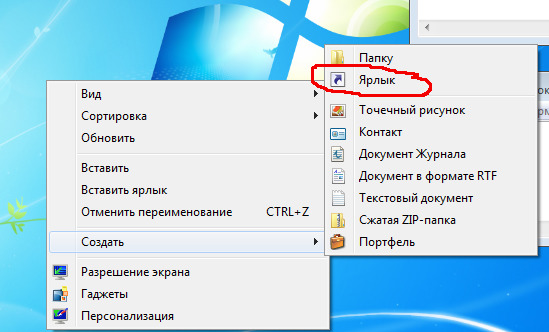  
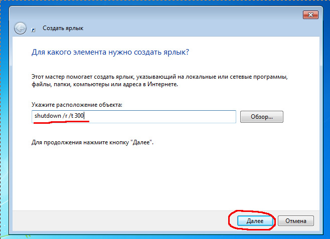  
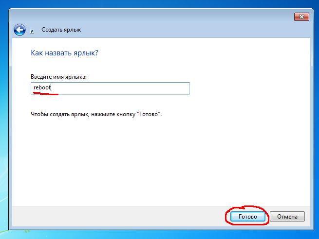  

#### затем правой кнопкой мыши на ярлыке:

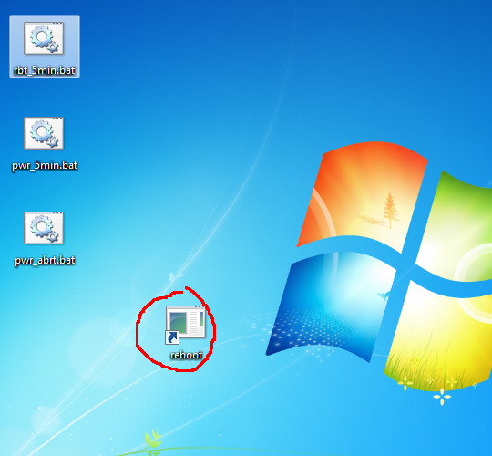  
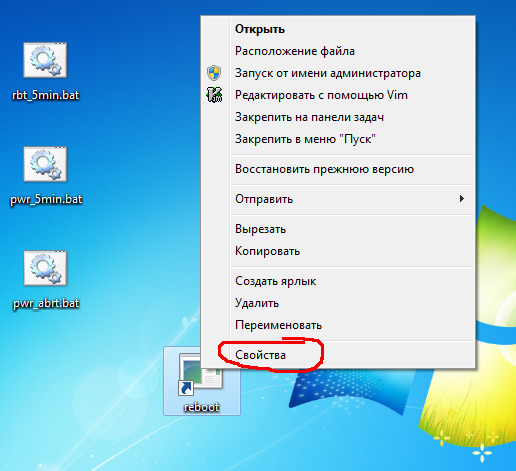  
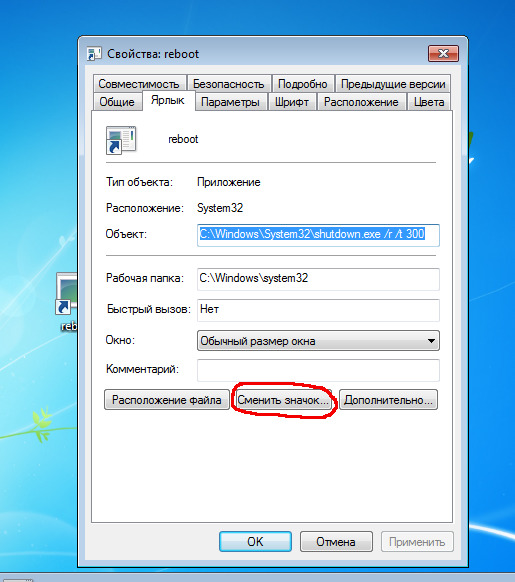  
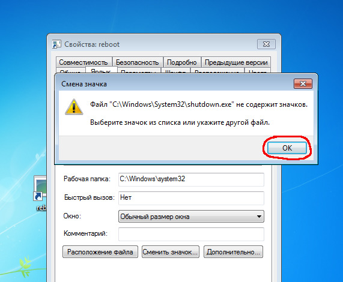  

#### если не нравится ни одна иконка внутри SHELL32.dll, можно порыться в
#### других исполняемых файлах (exe-файлах или dll-файлах) в поисках подходящей
#### иконки, или нарисовать с помощью графического редактора, сохранить её в
#### формате ico и выбрать.

  
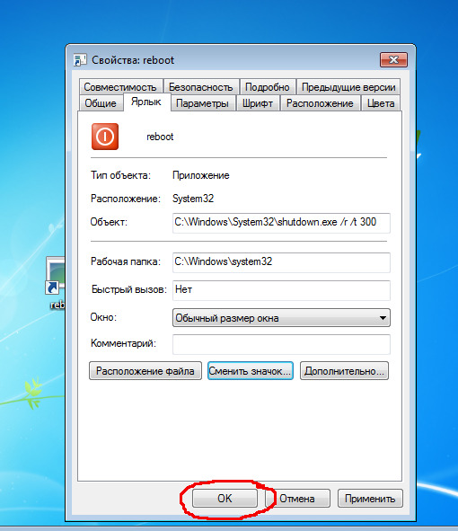  
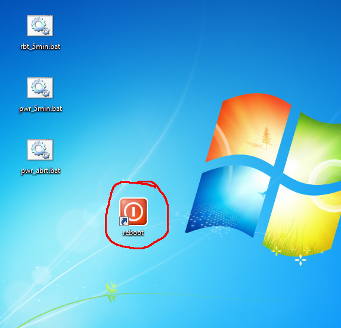  
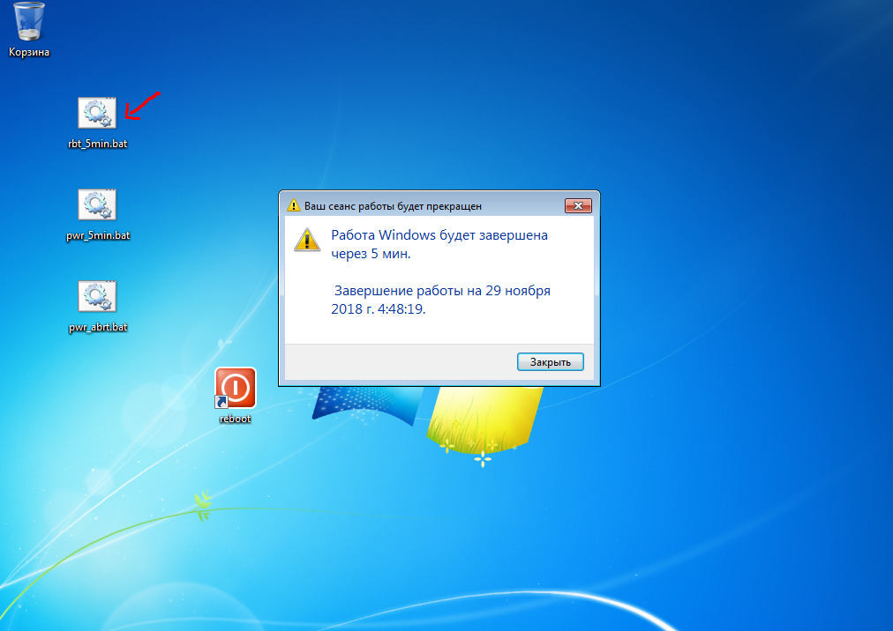  
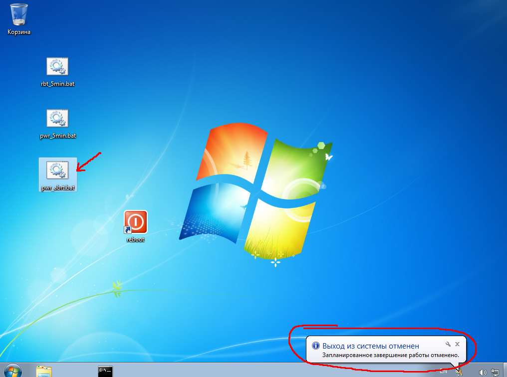  

#### больше статей на канале в Telegram [assistpc](https://t.me/assistpc)

